     

 

  

  # Menstrudel

  **Your Cycle & Pill Companion**

  
A free, private, and open-source period & pill tracking app for Android and iOS.

  

    
  

  

  

    
    
  

 

## Get Involved

- 🌐 **Translators:** [Help translate](https://crowdin.com/project/menstrudel)

- 💬 **Community:** [Join our official Discord Server](https://discord.gg/jWrH9DvACS)

 

## About Menstrudel

Menstrudel is a simple, private, and intuitive mobile application built with Flutter to help you track your menstrual cycle. Log your period start dates, record symptoms and flow intensity, and get predictions for your next cycle. Designed with privacy in mind, all your personal health data is stored securely offline on your device.

 

## Key Features

Take control of your menstrual health with an intuitive, private, and powerful tracker. Designed to be your all-in-one companion, it helps you understand your body, stay on top of your regimen, and anticipate your cycle with confidence.

### Smart Cycle Tracking 🩸
* **Log with a Tap:** Effortlessly record your periods.
* **Discover Your Patterns:** Track flow, pain, and symptoms to learn more about your body's unique rhythm.
* **See Your History:** A clear journal of your entire menstrual history, right at your fingertips.

### Predictive Insights 📊
* **Stay Prepared, Never Surprised:** Get accurate, forecasts for your next period based on your personal history.
* **Know Your Flow:** Understand your average cycle length and variations.
* **Visual Countdown:** A clean, simple countdown keeps you informed about when your next cycle is expected to begin.

### Effortless Pill Management 💊
* **Flexible Setup:** Easily customise your specific pill pack, whether it’s a 21/7, 28-day, or any other regimen.
* **Build Your Streak:** Log your daily intake with a single tap and track your adherence over time.

### LARC Tracking and Reminders 🗓️
* **Never Miss a Beat:** Log LARC usage, and track renewal dates with notification alerts.
* **Stay Informed:** Get timely, customisable notifications for upcoming device expiry.

### Timely & Customizable Reminders ⏰
* **Period Alerts:** Get a gentle heads-up a few days before your period is due.
* **Pill Reminders:** Never miss a pill with consistent daily notifications tailored to your schedule.
* **Hygiene Reminders:** For your health and safety, set discreet reminders to change your sanitary product.

### Absolute Privacy & Security 🔒
* **Your Data, Your Device:** All your sensitive health information is stored securely and exclusively on your phone using SQLite.
* **No Accounts, No Clouds:** Your privacy is our priority. No sign-ups, and your data never leaves your device.

### Beautifully Your Own ☀️/🌙
* **Stunning Themes:** Seamlessly switches between Light and Dark mode to match your system's theme.
* **Clutter-Free Design:** A clean, intuitive interface designed to be a pleasure to use every day.

 

## Privacy Policy

You can view our privacy policy [here](https://menstrudel.app/privacy/).

 

## Socials

- [Website](https://menstrudel.app/)
- [Discord](https://discord.gg/jWrH9DvACS)
- [ItsAllWidgets](https://itsallwidgets.com/menstrudel)
- [AlternativeTo](https://alternativeto.net/software/menstrudel/about/)

 

# App Screenshots

<table width="100%">
  <tr>
    <td width="25%" align="center"><b>Today screen</b></td>
    <td width="25%" align="center"><b>Quick log entry</b></td>
    <td width="25%" align="center"><b>Log calendar</b></td>
    <td width="25%" align="center"><b>Log insights</b></td>
  </tr>
  <tr>
    <td>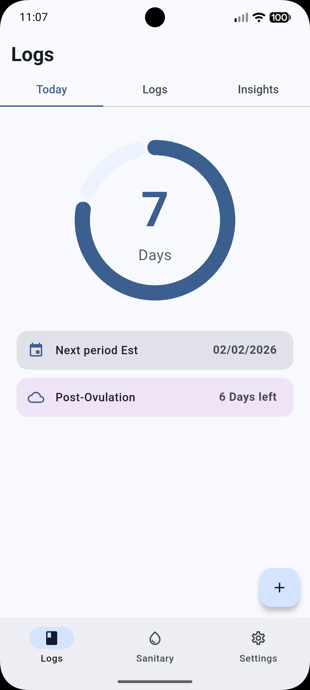</td>
    <td>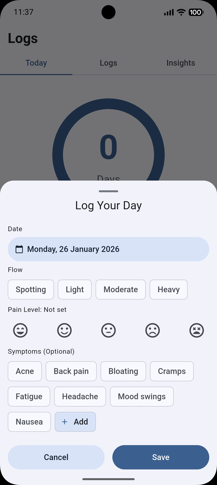</td>
    <td>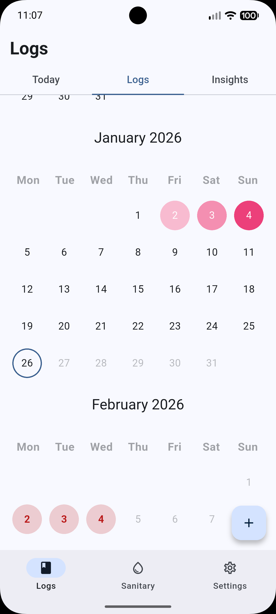</td>
    <td>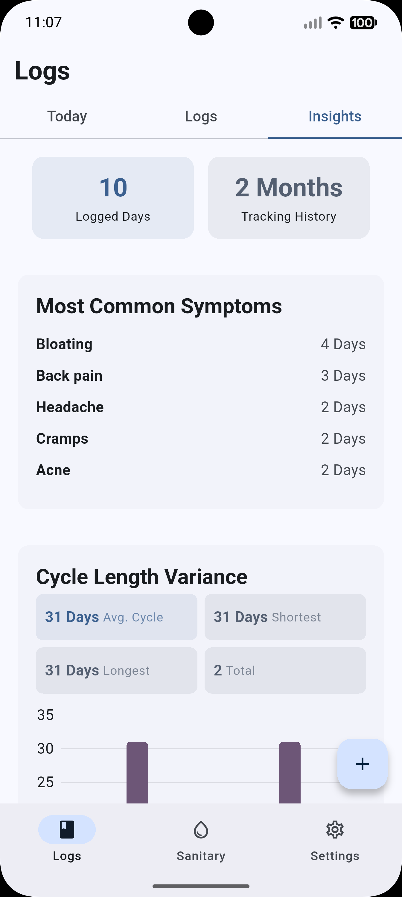</td>
  </tr>
  <tr>
    <td align="center"><b>Sanitary product reminder</b></td>
    <td align="center"><b>Sanitary product insights</b></td>
    <td align="center"><b>Pill reminders</b></td>
    <td align="center"><b>Settings</b></td>
  </tr>
  <tr>
    <td>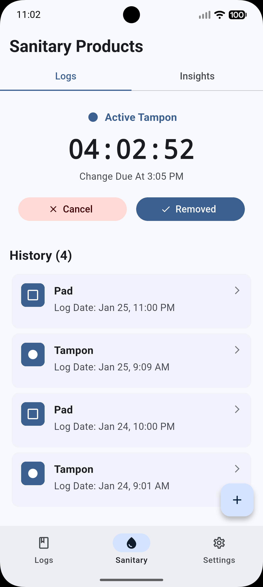</td>
    <td>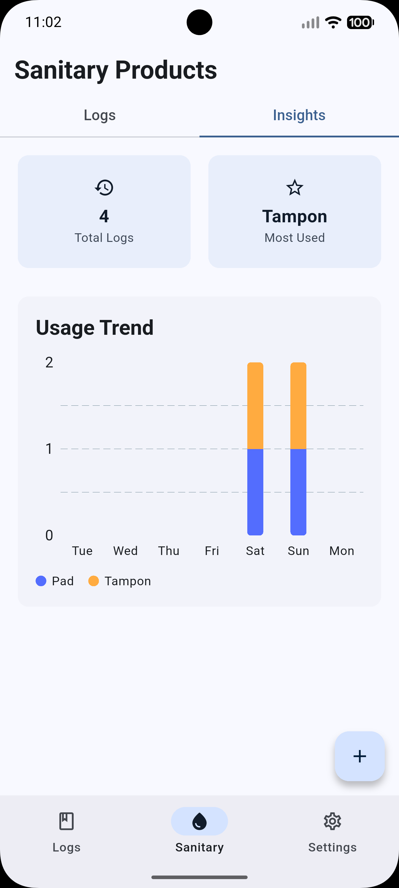</td>
    <td>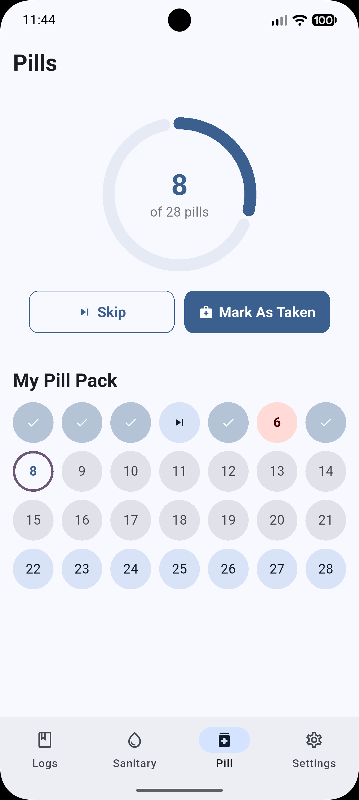</td>
    <td>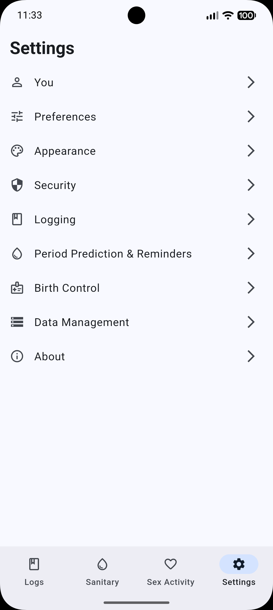</td>
  </tr>
  <tr>
    <td align="center"><b>Reversible contraceptives</b></td>
    <td align="center"><b>Sex logging</b></td>
    <td align="center"><b>Sex insights</b></td>
    <td align="center"><b>Widgets</b></td>
  </tr>
  <tr>
    <td>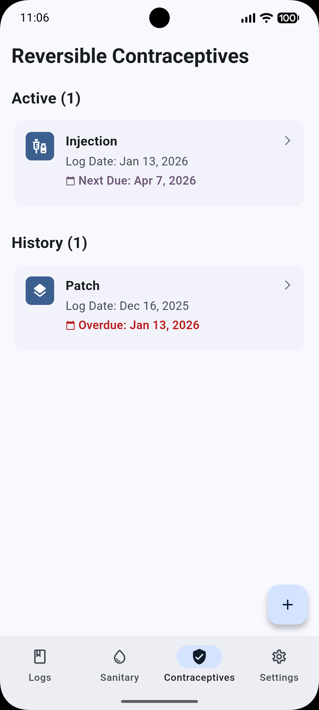</td>
    <td>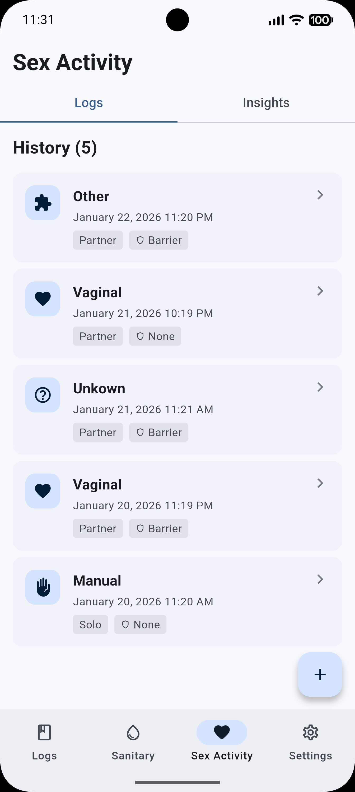</td>
    <td>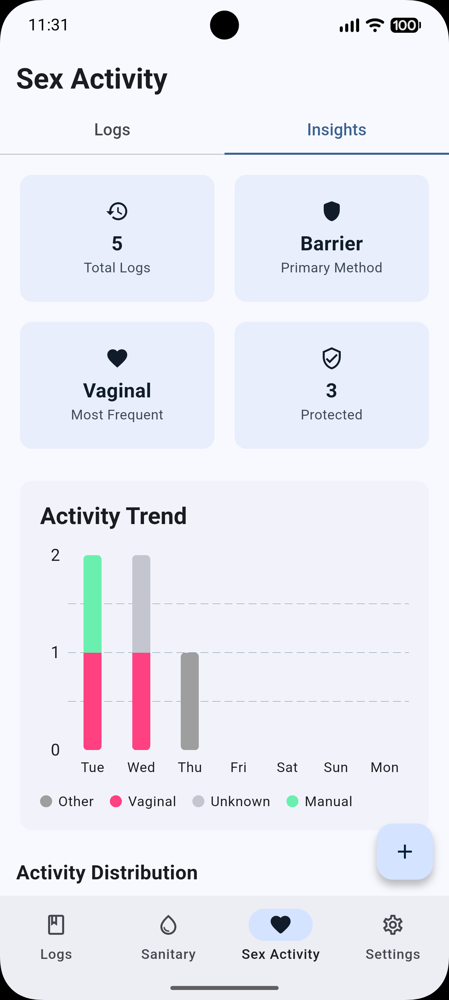</td>
    <td>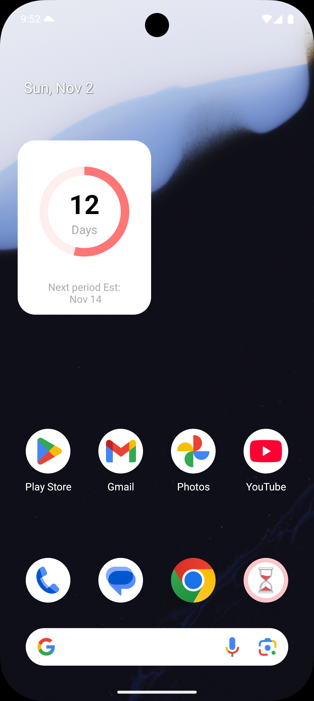</td>
  </tr>
</table>

# Wear OS

| Prediction View | Quick logging |
| :---: | :---: |
| 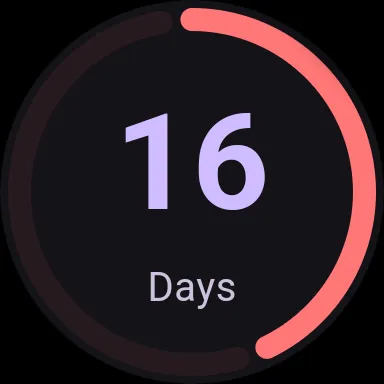 | 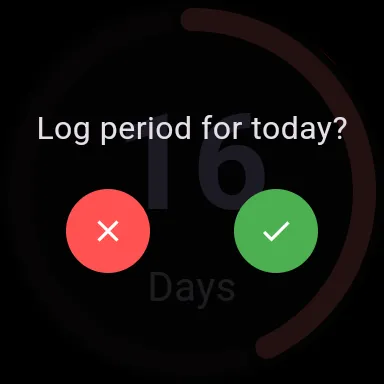 | 

# Star History

